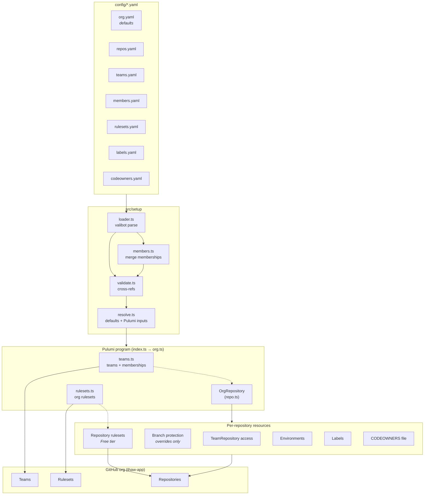
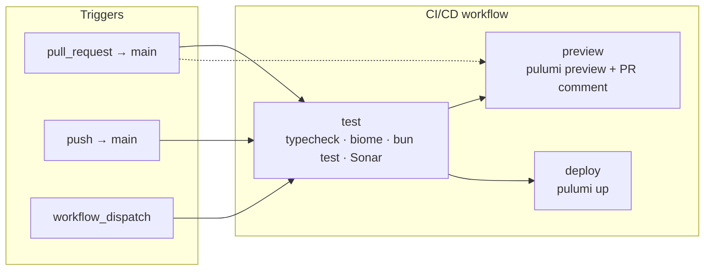

# Platform

[](https://github.com/thaw-app/platform/actions/workflows/ci.yml)
[](https://sonarcloud.io/summary/new_code?id=thaw-app_platform)
[](https://sonarcloud.io/summary/new_code?id=thaw-app_platform)

Platform configuration for the [`thaw-app`](https://github.com/thaw-app) GitHub organization — repositories, teams, branch rulesets, labels, and CODEOWNERS — declared in YAML under [`config/`](config/) and provisioned with [Pulumi](https://www.pulumi.com/) and the [`@pulumi/github`](https://www.pulumi.com/registry/packages/github/) provider. Runs on [Bun](https://bun.sh/).

This repository is the **control plane** for that org: it lives at [`thaw-app/platform`](https://github.com/thaw-app/platform), is not listed in [`config/repos.yaml`](config/repos.yaml), and is not provisioned by its own Pulumi program.

**Scope:** only repositories listed in [`config/repos.yaml`](config/repos.yaml) are managed here (teams, labels, CODEOWNERS, branch policy, and so on). Other org repos — notably **`Thaw`** and **`AXSwift`** — are administered manually and intentionally omitted from config (see the header comment in `repos.yaml`).

## Architecture



Source: [`docs/architecture.mmd`](docs/architecture.mmd). Edit the `.mmd` file and keep the README block in sync when the flow changes.

## Repository layout

| Path | Role |
| --- | --- |
| [`config/`](config/) | Declarative org config (YAML) and generated JSON Schemas for editor validation |
| [`src/setup/`](src/setup/) | Load, validate, and resolve config into Pulumi inputs |
| [`src/types/`](src/types/) | Valibot schemas and TypeScript types |
| [`src/resources/`](src/resources/) | Pulumi resources (teams, rulesets, per-repo components) |
| [`src/org.ts`](src/org.ts) | Program entry: wires setup output to resources |
| [`test/`](test/) | Unit tests (loader, validation, resolve, resources, schema generation) |
| [`.github/workflows/`](.github/workflows/) | CI/CD, reusable Pulumi workflow, drift detection |

## How it works

1. **Load & validate** — [`src/setup/loader.ts`](src/setup/loader.ts) parses each YAML file against a [valibot](https://valibot.dev/) schema in [`src/types/`](src/types/), merges member records from [`config/members.yaml`](config/members.yaml) into team definitions ([`src/setup/members.ts`](src/setup/members.ts)), then runs cross-reference checks ([`src/setup/validate.ts`](src/setup/validate.ts)): unknown team/repo references, branch patterns claimed by multiple rulesets, and labels defined in multiple groups.
2. **Resolve** — [`src/setup/resolve.ts`](src/setup/resolve.ts) fills each repo from org-wide `defaults` in [`config/org.yaml`](config/org.yaml) and translates config into Pulumi inputs.
3. **Provision** — [`src/org.ts`](src/org.ts) creates teams (when `enableTeams` is on), org rulesets (when `enableRulesets` is on), and one `OrgRepository` component ([`src/resources/repo.ts`](src/resources/repo.ts)) per entry in `repos.yaml`. Each component owns that repo's team access, repository rulesets (when org rulesets are off), optional branch-protection overrides, deployment environments, labels, and synced `.github/CODEOWNERS`.

Schemas use `strictObject`, so an unknown or misspelled YAML key fails the run instead of being silently ignored.

> **Branch enforcement:** [`config/rulesets.yaml`](config/rulesets.yaml) is the single policy source. With `enableRulesets: false` (GitHub Free — the default for `thaw-app`), that policy is provisioned as a **`RepositoryRuleset` on each managed repo** ([`src/resources/rulesets.ts`](src/resources/rulesets.ts)). With `enableRulesets: true` (Team/Enterprise only), the same file provisions **org-level** rulesets instead. Use per-repo `branchProtection` in `repos.yaml` only for legacy overrides (e.g. pin `build` instead of the default `ci` status check).

## CI/CD



| Workflow | File | When it runs |
| --- | --- | --- |
| **CI/CD** | [`.github/workflows/ci.yml`](.github/workflows/ci.yml) | PRs and pushes to `main` (markdown-only changes are ignored), merge queue, or manual dispatch |
| **Pulumi Setup** | [`.github/workflows/pulumi.yml`](.github/workflows/pulumi.yml) | Reusable: `preview` on PRs, `up` on `main`, or `preview --expect-no-changes` for drift |
| **Drift detection** | [`.github/workflows/drift.yml`](.github/workflows/drift.yml) | Weekly (Mondays 06:17 UTC) or `workflow_dispatch` |

| Trigger | Jobs |
| --- | --- |
| **PR opened / updated** | test → preview |
| **PR merged → push to `main`** | deploy only (merge commit detected; tests already ran on the PR) |
| **Direct push to `main`** | test → deploy |
| **`workflow_dispatch`** | test (manual) |

On push to `main`, merge commits are detected by message (`Merge pull request …` or squash `… (#123)`). Those skip **test** and run **deploy** only. A direct push (no merge markers) runs **test** then **deploy**.

To skip CI on a PR commit, add `[skip ci]` to the commit message. Required status checks will not run for that commit.

On `main`, **deploy** runs `pulumi up` against stack `diazdesandi/dev`. CI authenticates to Pulumi Cloud via OIDC; the GitHub provider uses the `PULUMI_GITHUB_TOKEN` repository secret (Actions' default `GITHUB_TOKEN` cannot manage org teams, labels, or cross-repo resources).

### Secrets

| Name | Where | Purpose |
| --- | --- | --- |
| `PULUMI_GITHUB_TOKEN` | GitHub Actions secret | Classic PAT with `admin:org` and `repo`; passed to the Pulumi GitHub provider as `GITHUB_TOKEN` in CI |
| `SONAR_TOKEN` | GitHub Actions secret | SonarCloud analysis in the `test` job |
| `github:token` | Pulumi stack config (`pulumi config set --secret`) | Same PAT scope for local `pulumi preview` / `pulumi up`; not read from Actions |

Pulumi Cloud access in CI uses OIDC ([`pulumi/auth-actions`](.github/workflows/pulumi.yml)) — no long-lived Pulumi token in repository secrets.

## Config files

| File | Schema | Purpose |
| --- | --- | --- |
| [`config/org.yaml`](config/org.yaml) | `OrgConfigSchema` | Org-wide defaults (visibility, merge strategy, squash commit shaping, feature toggles). |
| [`config/repos.yaml`](config/repos.yaml) | `ReposFileSchema` | Repositories and per-repo overrides (branch protection only for explicit exceptions). |
| [`config/rulesets.yaml`](config/rulesets.yaml) | `RulesetsFileSchema` | Org-level branch/tag/push rulesets. |
| [`config/teams.yaml`](config/teams.yaml) | `TeamsFileSchema` | Teams and per-repo team access. |
| [`config/members.yaml`](config/members.yaml) | `MembersFileSchema` | Org members and their team memberships. |
| [`config/labels.yaml`](config/labels.yaml) | `LabelGroupsSchema` | Issue/PR labels, grouped; applied to every repo. |
| [`config/codeowners.yaml`](config/codeowners.yaml) | `CodeownersFileSchema` | Global CODEOWNERS template synced to `.github/CODEOWNERS` in every managed repo. |

GitHub has no org-level CODEOWNERS file. This repo keeps one canonical template in `config/codeowners.yaml` and Pulumi writes it into each repository on `pulumi up`.

### Editor autocomplete

Each YAML file carries a `# yaml-language-server: $schema=...` header pointing at a generated JSON Schema in [`config/schema/`](config/schema/). With the [YAML extension](https://marketplace.visualstudio.com/items?itemName=redhat.vscode-yaml) for VS Code you get autocomplete and inline validation as you type. Regenerate the schemas after changing a valibot schema:

```sh
bun run schema
```

## Getting started

**Prerequisites:** [Bun](https://bun.sh/) 1.3+, [Pulumi CLI](https://www.pulumi.com/docs/install/), access to the [`diazdesandi`](https://app.pulumi.com/diazdesandi) Pulumi org, and a GitHub token with `admin:org` (and repo scope for managed repositories).

```sh
bun install
pulumi org set-default diazdesandi
pulumi stack select dev
pulumi config set github:token --secret   # first-time only; already set on the shared stack
pulumi preview                            # dry-run against thaw-app
```

Local runs need `pulumi login`. CI uses OIDC instead of a local token.

## Common tasks

**Add a repository** — append an entry to `config/repos.yaml` (only `name` and `description` are required; everything else inherits from `org.yaml` defaults). Grant team access in `config/teams.yaml` under `repoAccess`.

Set `autoInit: true` when Pulumi should create an empty GitHub repo (GitHub seeds the default branch). Set `autoInit: false` when the repo already exists. For pre-existing repos, add `adopt: true` so the first `pulumi up` imports the repo name into state (scoped by `github:owner`; remove `adopt` after a successful apply). Synced `.github/CODEOWNERS` comes from [`config/codeowners.yaml`](config/codeowners.yaml).

**Import an existing repository** — `autoInit: false`, `adopt: true`, then `pulumi up`. If a prior apply failed partway (component created, repository not), re-run `pulumi up` with `adopt: true` still set.

**Rename a managed repo on GitHub** — rename in the GitHub UI or API, update `name` in `repos.yaml`, and set `pulumiName` to the previous Pulumi resource prefix so state stays aligned (see `.github` / `pulumiName: dot-github`). Run [`scripts/rename_dot_github.sh`](scripts/rename_dot_github.sh) before applying the `dot-github` → `.github` config change.

**Add a team** — add it under `teams:` in `config/teams.yaml`, then reference its `slug` in `repoAccess` and/or `config/members.yaml`.

**Add a member** — append an entry to `config/members.yaml` with their `username` and team `slug`s. Omit `role` for the default (`member`); set `role: maintainer` only when they should manage that team's roster.

**Add a ruleset** — append to `config/rulesets.yaml`. A branch pattern may be owned by only one ruleset (validation enforces this).

**Add a label** — add it under any group in `config/labels.yaml`. Label names must be unique across groups.

## Scripts

```sh
bun run typecheck   # tsc --noEmit
bun run check       # biome lint + format check
bun run format      # biome check --write
bun test            # unit tests (setup, resources, schema)
bun run schema      # regenerate config/schema/*.json
pulumi preview      # dry-run (stack dev)
pulumi up           # apply (stack dev)
./scripts/drop_bootstrap_from_state.sh  # one-time: orphan legacy *-bootstrap files in state
```

Pre-commit hooks ([`.husky/pre-commit`](.husky/pre-commit)) run `biome lint`, `biome check`, and `bun test`.

### Bootstrap README cleanup (one-time)

If `pulumi up` fails deleting `*-bootstrap` `RepositoryFile` resources with **409** (“Changes must be made through a pull request”), branch protection was applied in the same run and GitHub no longer allows the API to delete those placeholder READMEs. The files are harmless — drop them from **Pulumi state only**:

```sh
pulumi stack select dev
./scripts/drop_bootstrap_from_state.sh
pulumi up   # or re-run CI deploy
```

## Stack config

Per-stack settings use the `thaw-config:` namespace (Pulumi project name from [`Pulumi.yaml`](Pulumi.yaml); npm package name is `platform`).

| Key | Purpose |
| --- | --- |
| `github:owner` | GitHub organization (`thaw-app`) |
| `github:token` | Provider credential (secret; set on stack for local runs) |
| `thaw-config:enableTeams` (default `true`) | Create teams and memberships |
| `thaw-config:enableRulesets` (default `true`) | Create org-level rulesets; when `false`, provision the same policy as per-repo repository rulesets |

### Stack

| Stack | Pulumi account | Purpose | Deployed by | `github:owner` | `enableRulesets` | `enableTeams` | Config file |
| --- | --- | --- | --- | --- | --- | --- | --- |
| `dev` | `diazdesandi` (personal) | Governs the live [`thaw-app`](https://github.com/thaw-app) org | [CI/CD](.github/workflows/ci.yml) `deploy` job on push to `main` | `thaw-app` | `false`¹ | `true` | [`Pulumi.dev.yaml`](Pulumi.dev.yaml) |

Pulumi project: **`thaw-config`**. Stack reference: **`diazdesandi/dev`**. `github:owner` is the **GitHub** org, not your Pulumi login.

```sh
pulumi config --stack dev   # inspect thaw-config:* and github:* keys
```

¹ **`enableRulesets: false`** on GitHub Free — org rulesets return **404**. Branch policy from [`config/rulesets.yaml`](config/rulesets.yaml) is applied via a **`RepositoryRuleset` on each managed repo**. Managed-repo CI jobs may use any of **`ci`**, **`build`**, or **`test`** as the status check name (`acceptAnyOf` in rulesets; provisioning pins `ci` by default — override per repo in `branchProtection` if needed).

### Drift detection

[`.github/workflows/drift.yml`](.github/workflows/drift.yml) runs weekly (Mondays 06:17 UTC) and on `workflow_dispatch`. It runs `pulumi preview --expect-no-changes` against `dev` — read-only, no state mutation.

**When it fails**, the workflow opens a GitHub issue (deduped by title). Remediate one of two ways:

1. **Keep the change** — update [`config/`](config/), open a PR, merge; CI/CD runs `pulumi up` on `main`.
2. **Reject the change** — revert the manual edit in the GitHub UI, then re-run **Drift detection** via `workflow_dispatch`.

When the check passes again, the `cleanup` job closes any open drift issues automatically.

Some drift is tolerated by design (per-repo ruleset exceptions managed in the GitHub UI — see comment in [`src/resources/rulesets.ts`](src/resources/rulesets.ts)). If weekly noise appears, document or codify those exceptions in config.
